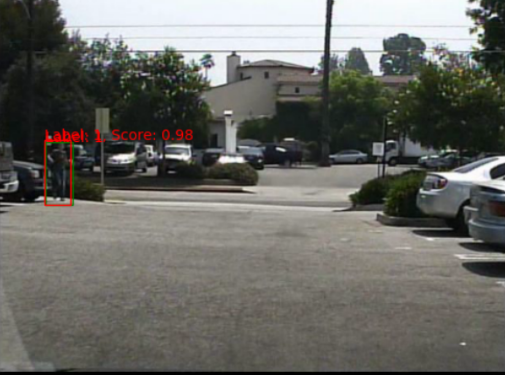

# Pedestrian detection neural networks

This repository explores the capabilities and limitations of currently employed object detection neural networks. 
The primary focus is comparing **Faster R-CNN** [1] and **SSD** [2] architectures. 
Evaluation of neural network efficiency considers training and inference times, and metrics commonly used in the field, such as 
Precision (P), Recall (R), and mean Average Precision (mAP).

To enhance the performance of Faster R-CNN, a self-attention mechanism is introduced. 
This mechanism enables the network to process objects more effectively by striving for more efficient feature highlighting. 
Additionally, various optimization techniques, including pruning and quantization, are applied to reduce the size of 
trained models and optimize inference time.

For training and testing, the Caltech Pedestrian [3] dataset is utilized.

## Requirements
Make sure you have the following dependencies installed:

```bash
colorlog>=6.7.0
matplotlib>=3.7.1
numpy>=1.23.5
pandas>=2.0.0
torch>=2.0.0+cu117
torchsummary>=1.5.1
torchvision>=0.15.1+cu117
tqdm>=4.65.0
```

## Installation
First, clone/download this repository. In the `const.py` file you will find this:

```python
root_mapping = {
        "ricsi": {
        "PROJECT_ROOT":
            "D:/storage_for_ped_det",
        "DATASET_ROOT":
            "D:/datasets/"
    }
}
```

- Update the designated username ('ricsi') to reflect the username associated with your logged-in operating system.
- Utilize PROJECT_ROOT as the central repository for storing essential data such as weights and images
- Employ DATASET_ROOT as the designated directory for managing datasets integral to the functioning of the project.
- `const.py` will create all the necessary folders.
- Download the dataset(s) and place them into the appropriate folder (in my case it is the DATASET_ROOT).

## Usage

First set up the parameters for training in `config.py`, such as **type_of_net**, **prune** and other hyperparameters.
After that, just run `train_model.py`. Finally, after training you can evaluate your model's performance with `eval.py`.

To quantize the model, run `quantization.py`. **NOTE**: it only works for Faster R-CNN.

<figure align="center">
  <figcaption>Pedestrian detection with Faster R-CNN</figcaption>
  
</figure>

## References
[1] - Girshick, R. (2015). Fast r-cnn. In Proceedings of the IEEE international conference on computer vision (pp. 1440-1448).

[2] - Liu, W., Anguelov, D., Erhan, D., Szegedy, C., Reed, S., Fu, C. Y., & Berg, A. C. (2016). 
Ssd: Single shot multibox detector. In Computer Vision–ECCV 2016: 14th European Conference, Amsterdam, 
The Netherlands, October 11–14, 2016, Proceedings, Part I 14 (pp. 21-37). Springer International Publishing.
